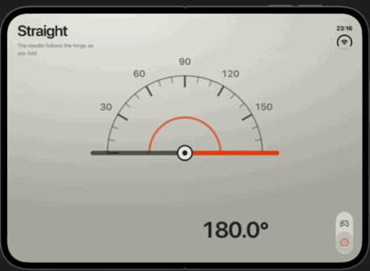
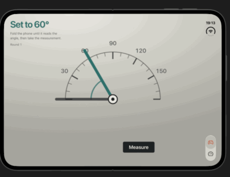
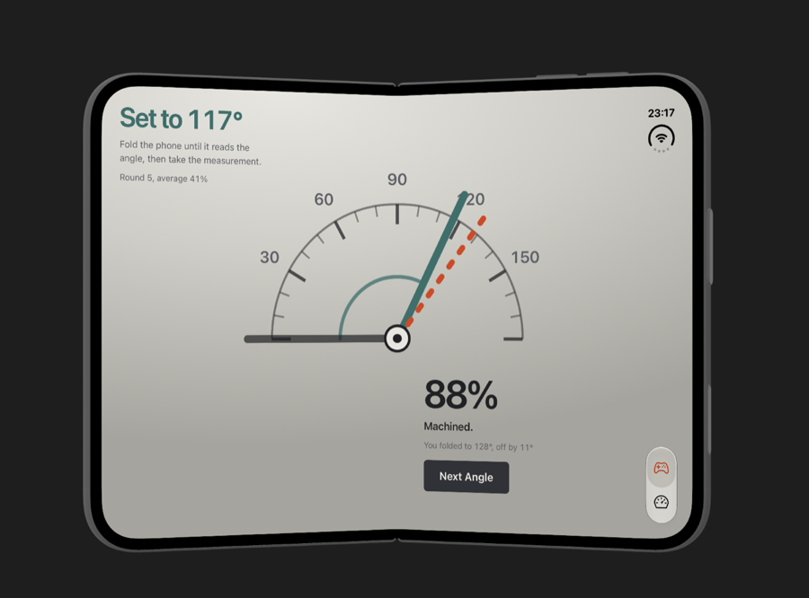
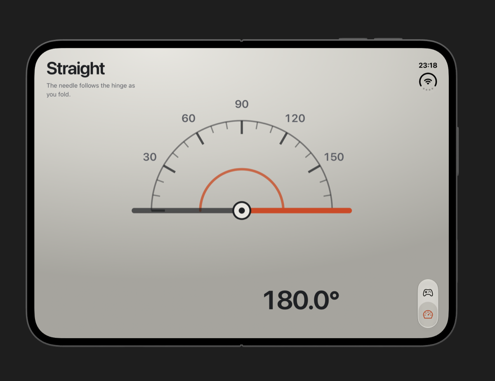

# Hinge Guess

Guess the hinge angle. The phone is the controller: fold it until you think you have hit the target angle, then tap to score.

Built with Ionic Angular, Capacitor and [`@erkamyaman/capacitor-foldable`](https://github.com/erkamyaman/capacitor-foldable). Runs on iPhone Duo (iOS 27.1 or later) and on Android foldables with a hinge sensor.

| | |
| --- | --- |
|  |  |
| **Meter.** The needle follows the hinge live. The protractor's pivot sits on the crease, so the phone's own hinge is the instrument's. | **Game.** A round names a target. Fold to it, then take the measurement. |
|  |  |
| The dashed arm shows where the phone actually was. | Flat at 180 degrees the instrument lies straight across both pages. |

## How it plays

- **Game.** Each round names a target between 30 and 165 degrees. Fold to it, tap **Measure**, and the round scores on how close you were. The target arm stays put, a dashed arm marks the angle you folded to, and accuracy carries over as an average across rounds.
- **Meter.** The live hinge angle on the same dial, with nothing to score. Useful for seeing what the sensor actually reports while you fold.
- Fold the phone shut and the app asks you to open it: there is no hinge angle to read on the outer display, so the tab bar goes away and a prompt takes the screen.

The dial is a bevel protractor drawn in SVG, and its pivot is placed at the middle of the fold the plugin reports, so the arms sweep across both pages. How long a move takes comes from how far the arm has to go: 140 ms plus 4.4 ms a degree, capped at 900 ms, which is quick for a nudge and unhurried for a sweep across the scale.

## What it uses from the plugin

| API | Used for |
| --- | --- |
| `isDeviceFoldable()` | Tell a foldable from a phone that can never play. |
| `getHingeAngle()` and `hingeAngleChange` | The live angle behind the dial and the score. |
| `getFoldState()` and `foldStateChange` | Whether the app is on the display with the fold, which decides between the game and the unfold prompt. |
| `getFoldState().hingeBounds` | The crease's position, which the dial's pivot is placed on. |

The hinge service also polls every 300 ms and refreshes on `visibilitychange`, `focus` and `resize`. iOS pauses the web view while the app moves between displays, so events can be missed while the phone is folding.

The tab bar itself is native, through [`@capgo/capacitor-native-navigation`](https://github.com/Cap-go/capacitor-native-navigation). Both modes are views of one instrument, so the bar swaps the view in place rather than routing: routing mounted a lazy page on every tap, which showed as a blank frame and a sideways slide.

On iOS 26 and later the system owns the tab bar's tint, so the icons carry their own colours and the window is tinted in `SceneDelegate.swift`.

## Run it

```bash
npm install
npm run build
npx cap sync
npx cap run ios      # pick the iPhone Duo simulator, Xcode 27.1 or later
```

Fold the simulator from DeviceHub, or use [`hinge`](https://github.com/artemnovichkov/hinge) to drive the angle from the terminal:

```bash
hinge sweep 180 60 2
```

Xcode 27 ships the simulator inside `DeviceHub.app` rather than `Simulator.app`; hold Option over the hinge slider for finer control.

## License

MIT
